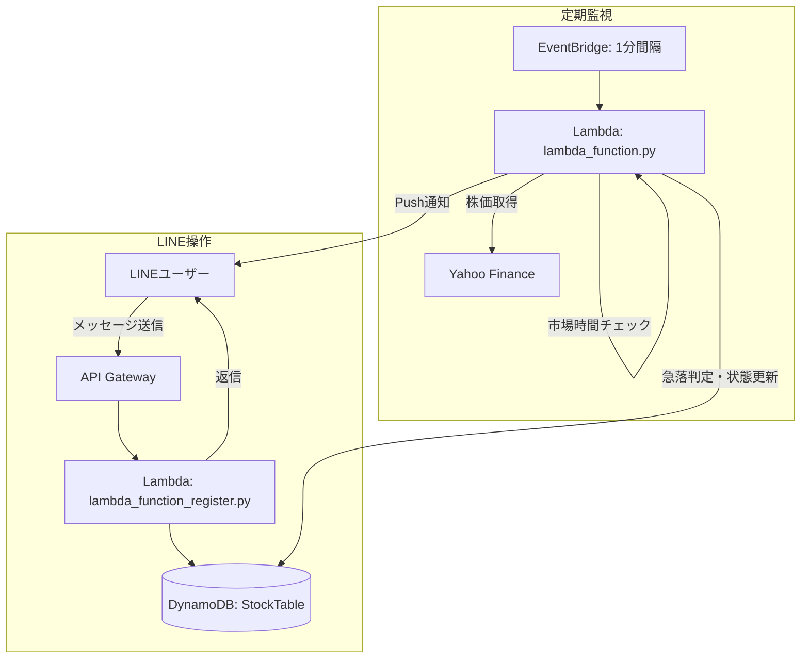

# 📈 Stock Crash Detector

LINEで銘柄を登録するだけで、1分ごとに株価急落を自動監視し、LINEへリアルタイム通知するサーバーレスシステムです。

> ⚠️ 本システムは株価の**急落を検知する**ツールであり、株価を**予測する**ものではありません。通知は機械的な変動検知であり、売買を推奨するものではありません。投資判断はご自身の責任で行ってください。

## Features

- LINEから「追加 / 削除 / 一覧 / 設定 / ヘルプ」で完結する操作性
- 銘柄コードだけで登録可能（会社名はYahoo Financeから自動取得、失敗時はフォールバック）
- 登録前に銘柄の存在確認を行い、誤登録を防止
- 前日比による3段階の急落レベル判定（LEVEL1/2/3）
- 同一急落状態での重複通知を防止し、回復後の再急落時は再通知
- ユーザーごと・銘柄ごとに急落しきい値をカスタマイズ可能
- 日本株の取引時間（前場・後場・昼休み・土日祝）を考慮し、無駄な外部APIアクセスを削減
- Yahoo Finance障害時もシステム全体を止めない設計（1銘柄単位でスキップ）
- CloudWatch Logsで原因追跡しやすいログ出力（機密情報は出力しない）

## Architecture



## Technology Stack

| 種別 | 技術 |
|---|---|
| Language | Python 3.12 |
| Compute | AWS Lambda（監視用 / LINE Webhook用の2関数） |
| API | Amazon API Gateway, LINE Messaging API |
| DB | Amazon DynamoDB（StockTable 1テーブル構成） |
| Scheduler | Amazon EventBridge（1分間隔） |
| 株価データ | Yahoo Finance Chart/Quote API（外部ライブラリ非依存） |
| CI/CD | GitHub Actions |

## System Flow

1. ユーザーがLINEで「追加 7203.T」を送信
2. API Gateway → `lambda_function_register.py` が銘柄の実在確認・会社名取得を行いDynamoDBへ登録
3. EventBridgeが1分ごとに `lambda_function.py` を起動
4. 市場時間外なら即終了（無駄なAPIアクセスを削減）
5. 市場時間内であれば、監視銘柄ごとにYahoo Financeから現在値・前日終値を取得
6. 前日比からLEVEL0〜3を判定し、DynamoDBに保存された前回のレベルと比較
7. レベルが新たに上昇した場合のみLINEへPush通知（重複通知防止）

## LINE Commands

| コマンド | 説明 |
|---|---|
| `追加 7203.T` | 銘柄を追加（会社名自動取得） |
| `追加 7203.T トヨタ` | 会社名を指定して追加 |
| `削除 7203.T` | 銘柄を削除 |
| `一覧` | 監視銘柄・現在値・前日比・しきい値を表示 |
| `設定` | 現在の設定（デフォルトしきい値・通知ON/OFF・監視銘柄数）を表示 |
| `設定 -3` | デフォルトの急落しきい値を-3%に変更 |
| `設定 7203.T -5` | 特定銘柄のしきい値のみ-5%に変更 |
| `ヘルプ` | コマンド一覧を表示 |

## Alert Logic

- LEVEL1（急落注意）: しきい値到達（デフォルト -2%）
- LEVEL2（急落警戒）: しきい値 -3%（デフォルト -5%）
- LEVEL3（暴落）: しきい値 -8%（デフォルト -10%）
- 各レベルは「初めて到達した時」のみ通知し、同レベル内での変動では再通知しない
- 前日比が0%以上（LEVEL0）まで回復すると状態がリセットされ、再度急落した際は再通知される

## Database Design

DynamoDB `StockTable`（既存構成を維持、後方互換性あり）

| 属性 | 型 | 説明 |
|---|---|---|
| UserID (PK) | String | LINEユーザーID |
| Symbol (SK) | String | 銘柄コード。ユーザー設定行は `#SETTINGS#` |
| CompanyName | String | 会社名 |
| Threshold | Number | 銘柄ごとの急落しきい値（%）。未設定時はユーザーのデフォルトを使用 |
| AlertLevel | Number | 現在の警戒レベル（0-3）。重複通知防止に使用 |
| LastPctChange / LastAlertTime | Number / String | 直近の検知内容（監視・デバッグ用） |
| CreatedAt / UpdatedAt | String | 作成・更新日時（ISO8601, JST） |
| DefaultThreshold / NotifyEnabled | Number / Bool | `#SETTINGS#` 行にのみ存在するユーザー設定 |

既存の「UserID / Symbol / CompanyName」のみのデータもそのまま動作します（新属性は未設定時にデフォルト値で補完されます）。

## AWS Architecture

- Lambda 2関数（監視用・LINE Webhook用）+ DynamoDB 1テーブル + EventBridge + API Gatewayというサーバーレス構成を維持
- 現状の利用規模（個人〜小規模）では `Scan` で十分と判断し、過剰なGSI追加は行っていない。将来的にユーザー数が大きく増える場合は、監視処理を `_fetch_all_watch_items()` に閉じ込めてあるため、GSI + Query方式への差し替えが局所的に可能

## Security

- LINEアクセストークンはコードに直接記述せず、環境変数（`LINE_CHANNEL_ACCESS_TOKEN`）から取得
- AWS認証情報はLambda実行ロールに委譲し、コードには含めない
- CloudWatch Logsにはユーザーの個人情報・アクセストークン・LINE APIのレスポンス本文は出力しない
- `.env` 等の秘密情報ファイルはGit管理対象外にすること（`.gitignore` を必ず確認）

## Testing

```bash
pip install -r requirements-dev.txt
pytest -v
```

- `tests/test_calculations.py`：前日比・急落レベルしきい値の計算
- `tests/test_alert_logic.py`：重複通知防止・再通知ロジック
- `tests/test_market_hours.py`：市場時間（土日祝・昼休み）判定
- `tests/test_line_commands.py`：LINEコマンド処理（DynamoDB/LINE APIはモック）

## Deployment

既存のGitHub Actionsによるデプロイ構成を踏襲してください。今回追加した `.github/workflows/ci.yml` はテスト・lintのみを行うワークフローで、既存のデプロイ用ワークフローを置き換えるものではありません（ファイル名が重複する場合は内容をマージしてください）。

## Environment Variables

| 変数名 | 説明 |
|---|---|
| `LINE_CHANNEL_ACCESS_TOKEN` | LINE Messaging APIのチャネルアクセストークン |
| `LOG_LEVEL` | ログレベル（任意、デフォルト `INFO`） |

## Future Improvements

- LINE Flex Messageによるカード形式通知
- Web管理画面（ダッシュボード・チャート・アラート履歴）
- 日本の取引カレンダーの外部ライブラリ／APIへの置き換え（祝日データの自動更新）
- ユーザー数増加時のDynamoDB GSI導入

## Disclaimer

本システムは株価の急落を機械的に検知して通知するものであり、投資助言・売買推奨を行うものではありません。実際の投資判断は必ずご自身の責任で行ってください。
